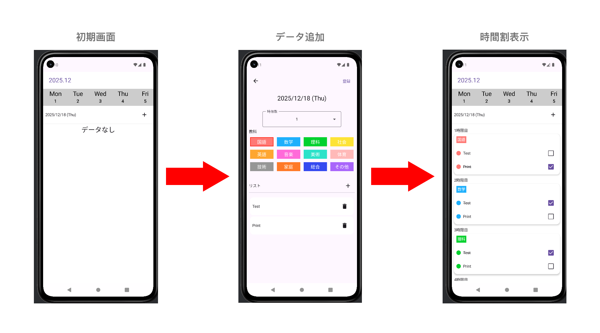
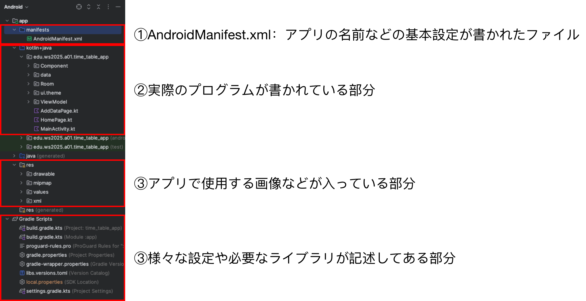
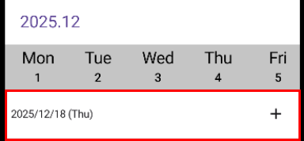
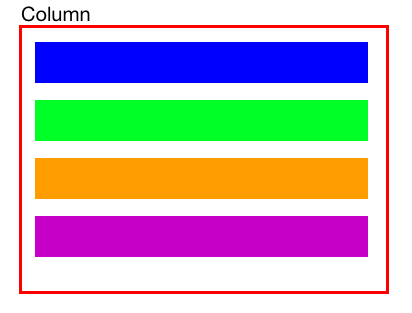
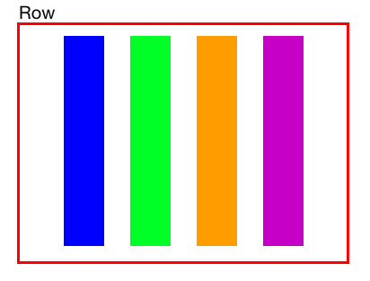
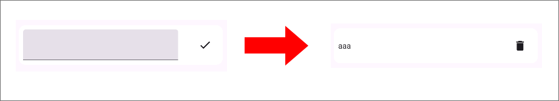
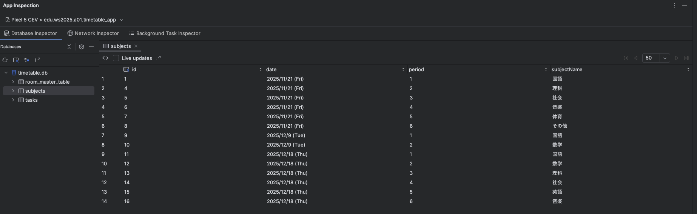

# 技能体験プログラム

## 作成するアプリの概要

### 時間割登録アプリ



- カレンダーで日付を選択
- 教科とやることを入力して時間割を登録
- 時間割の確認とチェックリストの状態変更ができる

## 作成環境

|OS|エディター|言語|フレームワーク|
|:--:|:--:|:--:|:--:|
|Android|Android Studio|kotlin|Jetpack Compose|

プログラムを書いていき、実際に手元にあるスマホに入れて操作していきます。

※今回はAndorid向けのアプリを作成します。

iPhone向けのアプリの場合、使用するエディターや言語が変わりますが、基本的な作り方には共通する部分が多くあります。

## 大まかな内容と手順
#### 1. 完成品を動かして作成アプリのイメージを作る
#### 2. 初期状態のコードを確認する
#### 3. 2つの画面を行き来するための準備をする
#### 4. 各教科の色のデータを準備する
#### 5. 教科名と色を組み合わせたデータクラスを作成する
#### 6. 各教科を選択するためのリストを作成する
#### 7. UI作りとPreview機能を使ってみる
#### 8. 2つの画面を行き来できるようにする
#### 9. 教科を選択するためのリストUIを作成する
#### 10. タスクリストを表示できるようにする
#### 11. データの登録とデータベースの中身を見てみる

#### EX. 色やデザインを変更して自分だけのアプリにする

## 作業開始！

### 1. 完成品を動かして作成アプリのイメージを作る

①完成プログラムをAndorid Studioで開く

②スマホをUSBケーブルでパソコンと接続

③画面上にある緑色の矢印ボタンを押してインストール

④色々と触っデータ登録を試してみる

### 2. 初期状態のコードを確認する

・time_table_app_starterというフォルダをAndroid Studioで開く



#### MainActivity.kt

```kotlin
@RequiresApi(Build.VERSION_CODES.UPSIDE_DOWN_CAKE)
@AndroidEntryPoint
class MainActivity : ComponentActivity() {
    override fun onCreate(savedInstanceState: Bundle?) {
        super.onCreate(savedInstanceState)
        enableEdgeToEdge()
        setContent {
            Scaffold { innerPadding ->
                App(modifier = Modifier.padding(innerPadding))
            }
        }
    }
}
```
アプリを起動した時に最初に実行されるコード部分

AndroidアプリはこのMainActivityというクラスがスタート地点になる。

### 3. 2つの画面を行き来するための準備をする


①NavControllerの作成

→このコントローラで実際に画面を切り替えることができる

②NavHostに切り替えたい画面をそれぞれ登録する

・App関数

```kotlin
@RequiresApi(Build.VERSION_CODES.UPSIDE_DOWN_CAKE)
@Composable
fun App(modifier: Modifier = Modifier) {
    //画面を切り替えるためのコントローラ
    val navController = rememberNavController()
    val insets = WindowInsets.safeDrawing.asPaddingValues()
    var targetDate = LocalDate.now()
    //全体の画面遷移用のNavHost
    NavHost(
        navController = navController, 
        //最初のページ名
        startDestination = "HomePage",
        modifier = Modifier.padding(
            top = insets.calculateTopPadding(),
            bottom = insets.calculateBottomPadding()
        )
    ) {
        //TODO 2.画面用Composableの登録
        //初期ページ
        composable("HomePage") { 
            HomePage {  }
        }
        //データ追加ページ
        composable("AddDataPage") { 
            AddDataPage(targetDate = targetDate) { }
        }
    }
}
```

### 4. 各教科の色のデータを準備する

各教科のテーマカラーを決める

ui.theme→Color.kt

```kotlin
//各教科のテーマカラー
val kokugoColor = Color(0xffff7272)
val sugakuColor = Color(0xff00b1ff)
val rikaColor = Color(0xff1ed317)
val syakaiColor = Color(0xffffe200)
val eigoColor = Color(0xffffa30f)
val ongakuColor = Color(0xffff62db)
val bijutuColor = Color(0xff30e5c9)
val taiikuColor = Color(0xffffb7b7)
val gijutuColor = Color(0xff969696)
val kateikaColor = Color(0xffff720a)
val sougouColor = Color(0xff234bf5)
val otherColor = Color(0xffa564ff)
```

#### カラーコードについて

Andoridのカラーコードの表し方には、ファイルの形式により2つのパターンがある

①`0x + 8桁`で表すパターン

```kotlin
0xFF000000 //black
0xFFFFFFFF //white
```

②`# + 8桁`で表すパターン

```XML
#FF000000
#FFFFFFFF
```
`0x`も`#`も16進数のカラーコードを表す記号

それぞれ、透明度とRGB(光の3原色)の形式

左から、**1,2桁：透明度 3,4桁：赤(R) 5,6桁：緑(G) 7,8桁：青(B)**　


### 5. 教科名と色を組み合わせたデータクラスを作成する

data→Model.kt

```kotlin
//教科名とテーマカラーをまとめたデータクラス　
data class SubjectData(
    val subject: String,
    val color: Color
)
```

 #### データクラス(モデルクラス)とは

一つのデータのかたまりをまとめて保持したい時に作成する、データを入れるためのもの

今回の使用例

①教科名＋教科のテーマカラー

②カレンダーの日付文字＋曜日の文字

③タスク名＋タスクの完了状態　など

kotlinの場合、`data class`という専用のものがある

### 6.各教科を選択するためのリストを作成する

AddDataPageで教科の選択をするため、教科リストを作成する

data→Data.kt

```kotlin
val subjectList = listOf<SubjectData>(
    SubjectData(
        "国語",
        kokugoColor
    ),
    SubjectData(
        "数学",
        sugakuColor
    ),
    SubjectData(
        "理科",
        rikaColor
    ),
    SubjectData(
        "社会",
        syakaiColor
    ),
    SubjectData(
        "英語",
        eigoColor
    ),
    SubjectData(
        "音楽",
        ongakuColor
    ),
    SubjectData(
        "美術",
        bijutuColor
    ),
    SubjectData(
        "体育",
        taiikuColor
    ),
    SubjectData(
        "技術",
        gijutuColor
    ),
    SubjectData(
        "家庭",
        kateikaColor
    ),
    SubjectData(
        "総合",
        sougouColor
    ),
    SubjectData(
        "その他",
        otherColor
    ),
    )
```

### 7. UI作りとPreview機能を使ってみる

以下の部分のUIを作成する



Component→DateHeader.kt

Jetpack Composeでは、UIとして使用する関数には`@Composable`アノテーションをつける

#### ①Previewの設定

記述したコードにあわせ、リアルタイムでUIのデザインを確認できるPreviewという機能がついている

`@Preview`アノテーションをつけることでPreviewが出せる

```kotlin
@Preview(showBackground = true)
@Composable
private fun DateHeaderPreview() {
    Time_table_appTheme {
        DateHeader(dateText = "2026/1/1 (Sun)"){}
    }
}
```

#### ②背景部分の作成

`Card`というコンポーネントを使用する

```kotlin
Card(
        modifier = Modifier
            .fillMaxWidth(),
        shape = RoundedCornerShape(0),
        colors = CardDefaults.cardColors(containerColor = Color.White),
        elevation = CardDefaults.elevatedCardElevation()
    ) {
```

#### ③テキストと`+`ボタンを配置する

要素を並べる時、縦並びにするか横並びにするかで囲むコンポーネントを使い分ける




今回は横並びのため、`Row`を使用する

```kotlin
@Composable
fun DateHeader(modifier: Modifier = Modifier,
                dateText: String,
                onAddClick: () -> Unit) {
    Card(
        modifier = Modifier
            .fillMaxWidth(),
        shape = RoundedCornerShape(0),
        colors = CardDefaults.cardColors(containerColor = Color.White),
        elevation = CardDefaults.elevatedCardElevation()
    ) {
        Row(
            modifier = Modifier.padding(8.dp),
            verticalAlignment = Alignment.CenterVertically
        ) {
        }
    }
}
```

テキストには、`Text`、+ボタンには`IconButton`をそれぞれ使用

```kotlin
@Composable
fun DateHeader(modifier: Modifier = Modifier,
                dateText: String,
                onAddClick: () -> Unit) {
    Card(
        modifier = Modifier
            .fillMaxWidth(),
        shape = RoundedCornerShape(0),
        colors = CardDefaults.cardColors(containerColor = Color.White),
        elevation = CardDefaults.elevatedCardElevation()
    ) {
        Row(
            modifier = Modifier.padding(8.dp),
            verticalAlignment = Alignment.CenterVertically
        ) {
            Text(dateText)
        
            IconButton(
                onClick = {
                    onAddClick()
                }
            ) {
                Icon(Icons.Default.Add, contentDescription = null)
            }
        }
    }
}
```

プラスボタンが左に寄ってしまうので、`Spacer`を入れて余白を埋める

完成例

```kotlin
@Composable
fun DateHeader(modifier: Modifier = Modifier,
                dateText: String,
                onAddClick: () -> Unit) {
    Card(
        modifier = Modifier
            .fillMaxWidth(),
        shape = RoundedCornerShape(0),
        colors = CardDefaults.cardColors(containerColor = Color.White),
        elevation = CardDefaults.elevatedCardElevation()
    ) {
        Row(
            modifier = Modifier.padding(8.dp),
            verticalAlignment = Alignment.CenterVertically
        ) {
            Text(dateText)
            Spacer(
                modifier = Modifier
                    .fillMaxWidth()
                    .weight(1f)
            )
            IconButton(
                onClick = {
                    onAddClick()
                }
            ) {
                Icon(Icons.Default.Add, contentDescription = null)
            }
        }
    }
}
```

### 8. 2つの画面を行き来できるようにする

HomePage内の`DateHeader`が呼び出されている部分に注目

```kotlin
DateHeader(
            dateText = targetDateText
        ) {
            onAddPressed(viewModel.targetDate.value)
        }
```

`onAddPressed`が呼び出されている

Step2で作成した`NavHost`の部分を見てみる

```kotlin
 NavHost(
        navController = navController, 
        //最初のページ名
        startDestination = "HomePage",
        modifier = Modifier.padding(
            top = insets.calculateTopPadding(),
            bottom = insets.calculateBottomPadding()
        )
    ) {
        //TODO 2.画面用Composableの登録
        //初期ページ
        composable("HomePage") { 
            HomePage {//ココ！  }
        }
        //データ追加ページ
        composable("AddDataPage") { 
            AddDataPage(targetDate = targetDate) { }
        }
    }
```

`onAddPressed`の動作を`HomePage`の{}の部分に記述することができる。

`navController`を用いて、遷移先を指定して画面を切り替え

```kotlin
composable("HomePage") {
            HomePage() {
                targetDate = it
                navController.navigate("AddDataPage")
            }
        }
```

### 9. 教科を選択するためのリストUIを作成する

リストには、大きく分けて2つの表示方法がある

①Vertical or Horizontal リスト
→1行に対して1項目ずつの普通のリスト

②Gridリスト
→今回のような縦x横のリスト


各アイテム用のUIは`SubjectIcon`として作成済

`LazyVertivalGrid`を使用してリストを表示

```kotlin
      LazyVerticalGrid(
            columns = GridCells.Fixed(count = 4),
            contentPadding = PaddingValues(4.dp),
            userScrollEnabled = false,
            verticalArrangement = Arrangement.spacedBy(12.dp),
            horizontalArrangement = Arrangement.spacedBy(12.dp)
        ) {
            items(subjectList) {
                SubjectIcon(
                    data = it,
                    isSelected = it.subject == selectedSubject
                ) {
                    viewModel.selectSubject(it.subject)
                }
            }
        }
```

### 10. タスクリストを表示できるようにする

タスク追加用リストを文字入力状態と完了状態でUIを変えられるようにする



`if`を使用して条件によって表示するUIを変更するようにする

Component→AddTaskListItem.kt

```kotlin
Row(
            modifier = Modifier
                .fillMaxWidth()
                .padding(8.dp),
            verticalAlignment = Alignment.CenterVertically
        ) {
            if (!isChecked) {
                TextField(
                    onValueChange = {
                        value = it
                    },
                    value = value
                )
            } else {
                Text(
                    value
                )
            }
            Spacer(
                modifier = Modifier
                    .fillMaxWidth()
                    .weight(1f)
            )
            if (!isChecked) {
                IconButton({
                    onChecked(Pair(index, value))
                }) {
                    Icon(Icons.Default.Check, contentDescription = null)
                }
            } else {
                IconButton({
                    onDeleted(index)
                }) {
                    Icon(Icons.Default.Delete, contentDescription = null)
                }
            }
        }
```


### 11. データの登録とデータベースの中身を見てみる

`AddDataPage`の`登録`ボタン部分を確認する

```kotlin
  TextButton({
                viewModel.addTask(
                    subject = SubjectEntity(
                        date = targetDateText,
                        period = selectedPeriod,
                        subjectName = selectedSubject
                    ),
                    taskList = taskList
                )
            }) {
                Text("登録")
            }
```

ボタンが押されると、addTaskという関数が動き、データがデータベースに登録される

#### 実際に登録されている様子を確認する

①App Inspectionの表示

View→Tool Windows→App Inspectionを選択

②データの登録

実際にアプリを操作して、データを登録する

③登録されたデータの確認

うまく登録されていれば、下の画像のようにテーブルが表示される



#### 補足
今回、データベースには`Room`というライブラリを使用

`Room`フォルダ内にデータベース系のプログラムが沢山入っているのでぜひ確認してみてください！

### ここまでできれば基本的な動作は完成！

もういちど最初のようにアプリをインストールして実行し、きちんと動いているかを確認してみよう

#### EX. カスタマイズしてみよう

例：教科の色を変更する、教科を追加する、文字の色やデザインを変更する　など

### ファイル一覧

今回のアプリのために記述しているファイルと簡単な説明の一覧

#### Component

- AddTaskListItem.kt
タスクを追加するためのリストに使用するアイテム

- CircleDot.kt
タスクアイテムの左に出ている丸いドットのUI

- DateHeader.kt
日付を選択した時のその日付と`+`ボタンがある部分
- DropDown.kt

何時間目かを選択するためのドロップダウン
- SubjectIcon.kt

教科選択で表示する教科のアイコン
- SubjectListItem.kt

時間割のリスト用アイテムUI
- TargetDatePickerDialog.kt

カレンダーで日付を選択するためのダイアログ
- TopCalendar.kt

HomePageの一月分の日付が表示されるカレンダー部分のUI

#### Data
- Data.kt

教科リストなどアプリ全体で使用するデータを記述するファイル
- Model.kt

様々なデータクラス(モデルクラス)を記述するファイル

#### Room

- AppModule
データベースを生成する設定などが記述されたファイル

- SubjectDao
Database Access object (DAO) と呼ばれるデータベースへのリクエストをまとめたファイル

- SubjectEntity
データベースの教科データ用テーブルの構造を定義するファイル

- SubjectWithTasks
教科データと対応するタスクデータをまとめるデータクラス

- TaskEntity
データベースのタスクデータ用テーブルの構造を定義するファイル

- TimeTableDatabase
作成するテーブルやデータベースのバージョンなどを指定するファイル

- TimetableRepository
DAOへの受付役となるファイル

#### ui.theme

- Color.kt
アプリで使用する色データなどがまとまったファイル

- Theme.kt
アプリのテーマカラーなどのテーマデータがまとまったファイル

- Type.kt
文字のサイズやスタイルなどがまとまったファイル

#### ViewModel

`ViewModel`とは

→UIに渡すためのデータを保持したり、動作をするための関数をまとめたりしているクラス。これによりUIとデータがファイルごとに切り分けられてわかりやすくなったり画面が更新されてもデータを保持し続けたりできる。

- AddDataViewModel
AddDataPageで使用するデータや動作がまとまったファイル

- HomeViewModel
HomePageで使用するデータや動作がまとまったファイル

#### その他

- AddDataPage.kt
データ追加ページの画面全体のUI

- HomePage.kt
時間割ページの画面全体のUI

- MainActivity.kt
アプリスタート時に最初に実行されるコード+NavHost

