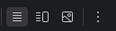
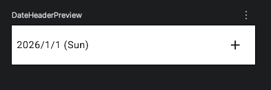

# 技能体験プログラム

## 作成するアプリの概要

### 時間割登録アプリ


- カレンダーで日付を選択
- 教科とやることを入力して時間割を登録
- 時間割の確認とチェックリストの状態変更ができる

## 作成環境

|OS|エディター|言語|フレームワーク|
|:--:|:--:|:--:|:--:|
|Android|Android Studio|kotlin|Jetpack Compose|

iPhone向けのアプリの場合、使用するエディターや言語が変わりますが、基本的な作り方には共通する部分が多くあります

## Step
#### 0. 完成品を動かしてみる
#### 1. 画面を切り替えられるようにする
#### 2. 教科のテーマカラーを変更してみる
#### 3. 教科の変更・追加をする
#### 4. Preview機能をつかってみる
#### 5. アイコンを変更してみる
#### 6. 背景や文字をカスタマイズする
#### 7. データベースを確認してみる

#### EX. 色やデザインを変更して自分だけのアプリにする

### Step 0.完成品を動かしてみる

①完成プログラムをAndorid Studioで開く

②スマホをUSBケーブルでパソコンと接続

③画面上にある緑色の矢印ボタンを押してインストール

④色々と触ってアプリの動きを試してみる

### Step 1.画面を切り替えられるようにする

①time_table_app_starter_2を開く

#### アプリファイルの構造


今回のアプリは約25個くらいのプログラムファイルで作られています。各ファイルの概要はテキストの最後に載せてあります

② HomePage.ktを開き TODO1を見つける

#### 画面切り替えのイメージ


③コードを追加する

```kotlin
 NavHost(
        navController = navController, startDestination = "HomePage",
        modifier = Modifier.padding(
            top = insets.calculateTopPadding(),
            bottom = insets.calculateBottomPadding()
        )
    ) {
        //↓追加
        //初期ページ
        composable("HomePage") {
            HomePage() {
                targetDate = it
                navController.navigate("AddDataPage")
            }
        }
        //データ追加ページ
        composable("AddDataPage") {
            AddDataPage(targetDate = targetDate) {
                navController.navigate("HomePage")
            }
        }
        //↑ここまで
    }
```

④画面が切り替わるかを試してみる

### Step 2.教科のテーマカラーを変更してみる

①Color.ktを開き、TODO2を見つける

②値を変えて各教科の色を変更してみる

→左側の色が表示されている部分をクリックするとカラーパレットが出るのでそこから色の変更ができます

#### 色の値の意味

```kotlin
0xFF000000 //black
0xFFFFFFFF //white
```
`0x`は16進数のカラーコードを表す記号

それぞれ、透明度とRGB(光の3原色)の形式

左から、**1,2桁：透明度 3,4桁：赤(R) 5,6桁：緑(G) 7,8桁：青(B)**　


### Step 3.教科の変更・追加をする

①Data.ktを開き、TODO3を見つける

②教科の名前を変更したり、追加したりしてデータ追加画面で選べる教科が増えてるかを確認する

### モデルクラス(データクラス)について

今回のように、教科の名前と色のような複数のデータをまとめたい場合、モデルクラスというものを作成すると便利

Model.kt

```kotlin
//追加不要
//教科名とテーマカラーをまとめたデータクラス　
data class SubjectData(
    val subject: String, //教科名
    val color: Color.    //色データ
)
```
#### Step 4.Preview機能をつかってみる

これまではデザインを変えるたびにアプリを再起動していましたが、画面の一部のデザインを確認したい場合、`Preview`という機能を使うことができます

①DateHeader.ktを開き、TODO4を見つける

②以下のコードを追加する
```kotlin
@Preview(showBackground = true)
@Composable
private fun DateHeaderPreview() {
    Time_table_appTheme {
        DateHeader(dateText = "2026/1/1 (Sun)"){}
    }
}
```

③プレビューを見てみる

画面右上のアイコンで切り替え



左から、**コードのみ**、**Previewとコード**、**Previewのみ**

表示例



### Step 5.アイコンを変更してみる

①同じファイルの少し上のTODO5を見つける

②アイコンを変更する

```kotlin
Icon(Icons.Default.Add, contentDescription = null)
```

例

`Icons.Default.Star`: 星の形のアイコン

`Icons.Default.Home`: 家の形のアイコン　などなど

プログラムを変更するとすぐにPreviewに反映されるので好きなアイコンに変更してみよう！

### Step 6.背景や文字をカスタマイズする

①背景の色を変更してみる

`Card`の部分

```kotlin
 Card(
        modifier = Modifier
            .fillMaxWidth(),
        shape = RoundedCornerShape(0),
        colors = CardDefaults.cardColors(containerColor = Color.White) //ココ,
        elevation = CardDefaults.elevatedCardElevation()
    ) {...
```

例

`Color.Red`：背景が赤色になる

`kokugoColor`：Step2で決めた国語用の色になる　などなど

②文字の大きさや色、太さを変更してみる

`Text`の部分

```kotlin
  Text(dateText) //ココ
```

- 文字サイズの変更

```kotlin
  Text(dateText, style = TextStyle(fontSize = 24.sp))
```
`fontSize`に文字サイズを指定

- 文字の色を変更

```kotlin
Text(dateText, style = TextStyle(fontSize = 24.sp, color = kokugoColor))
```
`color`に使いたい色を指定

- 文字の太さを指定

```kotlin
Text(dateText, style = TextStyle(fontSize = 24.sp, fontWeight = FontWeight.Bold))
```
`fontWeight`に太さを指定

Previewを見ながら好きなデザインにしてみよう

### Step 7.データベースを確認してみる

①App Inspectionの表示

View→Tool Windows→App Inspectionを選択

②データの登録

実際にアプリを操作して、データを登録する

③登録されたデータの確認

うまく登録されていれば、下の画像のようにテーブルが表示される


これが実際にアプリ内で保存されている時間割データの一覧

#### 補足
今回、データベースには`Room`というライブラリを使用

`Room`フォルダ内にデータベース系のプログラムが沢山入っているのでぜひ確認してみてください！

### EX. 色やデザインを変更して自分だけのアプリにする

文字や色、アイコンなどを変更してデザインを改善してみよう！

### 参考　各ファイルの概要

#### Component

- AddTaskListItem.kt
タスクを追加するためのリストに使用するアイテム

- CircleDot.kt
タスクアイテムの左に出ている丸いドットのUI

- DateHeader.kt
日付を選択した時のその日付と`+`ボタンがある部分
- DropDown.kt
何時間目かを選択するためのドロップダウン

- SubjectIcon.kt

教科選択で表示する教科のアイコン
- SubjectListItem.kt

時間割のリスト用アイテムUI
- TargetDatePickerDialog.kt

カレンダーで日付を選択するためのダイアログ
- TopCalendar.kt

HomePageの一月分の日付が表示されるカレンダー部分のUI

#### Data
- Data.kt
教科リストなどアプリ全体で使用するデータを記述するファイル

- Model.kt

様々なデータクラス(モデルクラス)を記述するファイル

#### Room

- AppModule
データベースを生成する設定などが記述されたファイル

- SubjectDao
Database Access object (DAO) と呼ばれるデータベースへのリクエストをまとめたファイル

- SubjectEntity
データベースの教科データ用テーブルの構造を定義するファイル

- SubjectWithTasks
教科データと対応するタスクデータをまとめるデータクラス

- TaskEntity
データベースのタスクデータ用テーブルの構造を定義するファイル

- TimeTableDatabase
作成するテーブルやデータベースのバージョンなどを指定するファイル

- TimetableRepository
DAOへの受付役となるファイル

#### ui.theme

- Color.kt
アプリで使用する色データなどがまとまったファイル

- Theme.kt
アプリのテーマカラーなどのテーマデータがまとまったファイル

- Type.kt
文字のサイズやスタイルなどがまとまったファイル

#### ViewModel

`ViewModel`とは

→UIに渡すためのデータを保持したり、動作をするための関数をまとめたりしているクラス。これによりUIとデータがファイルごとに切り分けられてわかりやすくなったり画面が更新されてもデータを保持し続けたりできる。

- AddDataViewModel
AddDataPageで使用するデータや動作がまとまったファイル

- HomeViewModel
HomePageで使用するデータや動作がまとまったファイル

#### その他

- AddDataPage.kt
データ追加ページの画面全体のUI

- HomePage.kt
時間割ページの画面全体のUI

- MainActivity.kt
アプリスタート時に最初に実行されるコード+NavHost